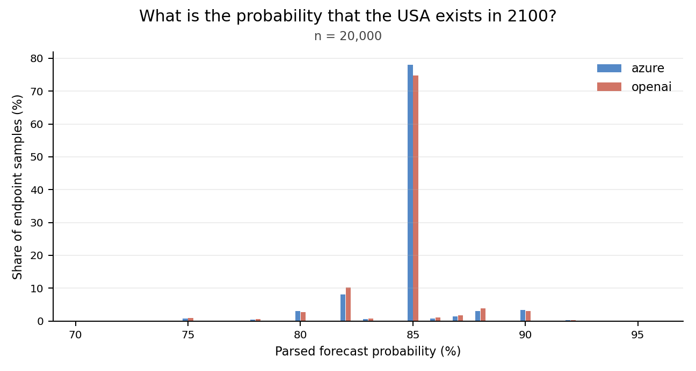
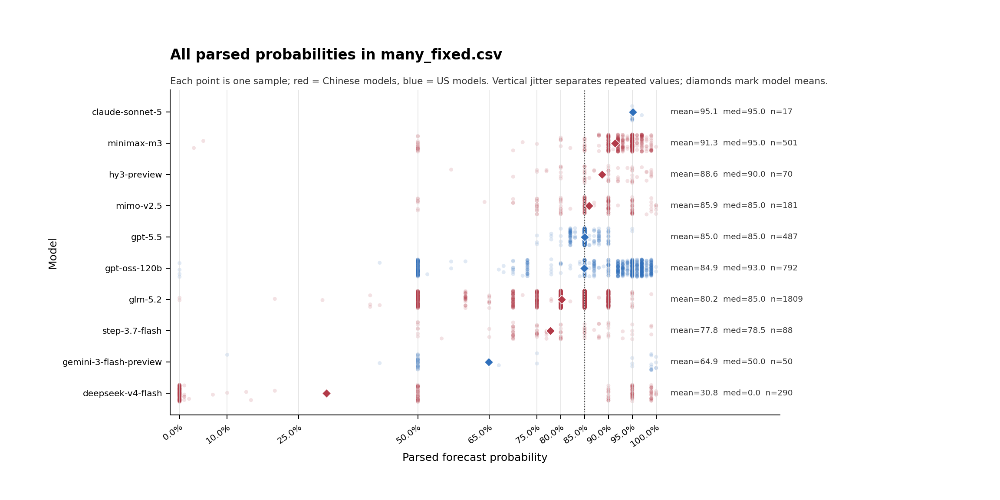
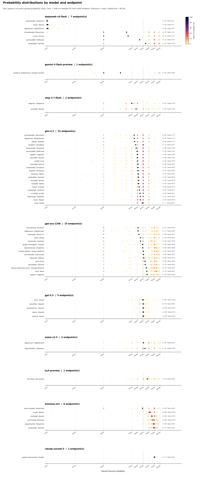

# Does GPT 5.5 on different endpoints have different behavior? Yes.

I asked GPT 5.5 the probability that the US would exist in 2100. I did this across multiple, independent runs during a day. The smallest runs were of sample size 100, the largest 10,000. This cost ~$80.

> Note: This was my own money. I normally use free credits, but this was out of pocket. 

The result was always the same. An almost identical graph, with a small (but significant) difference by endpoint.

I chose this question because it's just the right amount of randomness. For example, when I asked different models to answer 'pick a number from 1-10', in my sample they picked 7 every time. "Will the US exist in 2100" immediately had different results by model. It also was cheap, requiring few output tokens and reasoning tokens. This let me use more samples.

This exact question is meaningless. At least to me. Its point is to show that endpoints change output. I don't know how. For GPT 5.5, there were no safety filter issues between Azure and OpenAI. So, I assume some sort of internal infrastructure issue. Maybe different gpus? I don't know. I would like to know. If you know why or suspect why, my email is johnfriedman@datamule.xyz.

> Note: testing different endpoints like this only became easy recently. It uses [router metadata](https://openrouter.ai/docs/guides/features/router-metadata). Until a few weeks ago, router metadata was broken. Very glad the OR team fixed this issue.

## Data

- gpt_5_1000.csv: one of the initial gpt 5.5 runs.
- gpt5_5_10000.csv: the final 10,000 gpt 5.5 run.
- many_100.csv: the same question asked on many different models and endpoints. 100 samples each. Many failed due to safety filters.

runs-archive-incomplete/ has the full response jsons for most of the runs.

## Different Models

After running the 10,000 sample, I wondered if Chinese models have noticeably different forecasts than American models on the longevity of our Republic. They don't. But still, kinda neat graphics.

> Note: the choice of question may have been influenced by proximity to the 4th of July. If you like fireworks, please look up: "Los Angeles panorama fireworks eveywhere"

